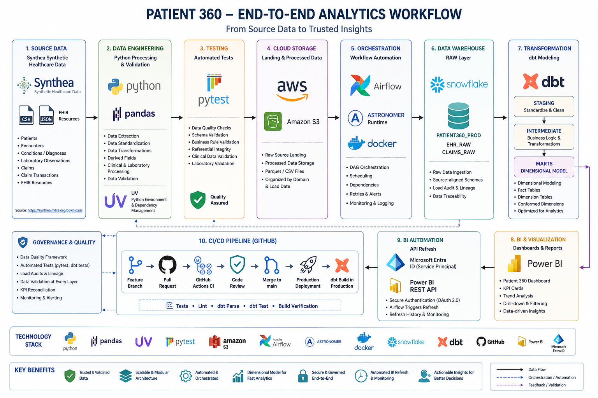

# Patient 360 — Healthcare Analytics Engineering

## 1. Project Overview

Patient 360 is an end-to-end healthcare analytics engineering project that transforms heterogeneous synthetic healthcare source data into trusted, production-ready analytical datasets and business intelligence.



The project demonstrates the complete data lifecycle:

```text
Source Data
    ↓
Python / pandas
    ↓
Validation / pytest
    ↓
AWS S3
    ↓
Apache Airflow
    ↓
Snowflake RAW
    ↓
dbt STAGING
    ↓
dbt INTERMEDIATE
    ↓
dbt MARTS
    ↓
Power BI
```

The platform incorporates data validation, automated testing, orchestration, warehouse auditing, analytical modeling, CI/CD, production deployment, dashboard validation, and automated Power BI refresh.

---

## 2. Business Objective

The objective is to provide a unified analytical view of patient, encounter, clinical, laboratory, diagnosis, and claims data.

The solution supports analysis of:

- Patient populations
- Healthcare encounters
- Hospital utilization
- 30-day readmissions
- Length of stay
- Laboratory abnormalities
- Chronic disease prevalence
- Healthcare claims and costs

The project is designed as an Analytics Engineering implementation demonstrating how raw healthcare data can be transformed into governed analytical datasets for business intelligence.

---

## 3. Source Data

The project uses synthetic healthcare data generated using **Synthea**, an open-source synthetic patient generator.

**Official Synthea source/download page:**

https://synthea.mitre.org/downloads

The source data includes healthcare domains such as:

- Patients
- Encounters
- Conditions / Diagnoses
- Laboratory observations
- Claims
- Claim transactions
- FHIR resources

The project includes both CSV-based healthcare datasets and FHIR/JSON-derived clinical data.

### Synthetic Data Disclaimer

The project uses synthetic healthcare data generated by Synthea.

The dataset is intended for demonstrating healthcare data engineering, analytics, and BI workflows and does not represent real-world clinical or financial populations.

---

# 4. High-Level Architecture

```text
                         SOURCE DATA
                              |
                              v
                   +----------------------+
                   | Python / pandas      |
                   | Preprocessing        |
                   | Validation           |
                   +----------+-----------+
                              |
                              v
                         +---------+
                         |   S3    |
                         | Landing |
                         | Processed|
                         +----+----+
                              |
                              v
                    +------------------+
                    | Apache Airflow   |
                    | Orchestration    |
                    +--------+---------+
                             |
                             v
                  +----------------------+
                  | Snowflake            |
                  | PATIENT360_PROD      |
                  |                      |
                  | EHR_RAW / Claims RAW |
                  +----------+-----------+
                             |
                             v
                       +-----------+
                       |    dbt    |
                       +-----+-----+
                             |
              +--------------+--------------+
              |              |              |
              v              v              v
          STAGING      INTERMEDIATE       MARTS
                                            |
                                            v
                                      +-----------+
                                      | Power BI  |
                                      +-----------+
```

---

# 5. Technology Stack

| Area | Technology |
|---|---|
| Source data | Synthea, CSV, FHIR/JSON |
| Programming | Python |
| Python environment / dependency management | UV |
| Data processing | pandas |
| Automated Python testing | pytest |
| Cloud storage | AWS S3 |
| Workflow orchestration | Apache Airflow |
| Airflow runtime | Astro Runtime |
| Containerization | Docker |
| Data warehouse | Snowflake |
| Transformation | dbt |
| Transformation language | SQL |
| Source control | Git |
| Repository | GitHub |
| CI/CD | GitHub Actions |
| Business intelligence | Power BI |
| BI authentication | Microsoft Entra service principal |
| BI automation | Power BI REST API |
| Development environment | VS Code |

---

# 6. Source Profiling and Data Assessment

Before pipeline implementation, the source datasets were profiled to understand:

- Dataset structure
- Column definitions
- Data types
- Primary/business identifiers
- Relationships between entities
- Date fields
- Nullability
- Duplicate records
- Referential integrity
- Data-quality limitations
- Analytical grain

The profiling stage established the foundation for the subsequent ingestion and analytical modeling design.

The project intentionally does not attempt to make synthetic source data behave like a real-world clinical population beyond what is required for the analytical use cases.

---

# 7. Python Data Engineering

Python is used for source-data preprocessing and validation.

The processing layer uses pandas for tasks such as:

- Data type normalization
- Date parsing
- Column standardization
- Data preparation
- Derived analytical fields
- Referential validation
- Clinical data validation
- Laboratory data processing

The Python implementation separates processing logic from validation logic so that validation functions can be tested independently.

---

# 8. FHIR / Clinical Data Processing

FHIR/JSON clinical resources are processed as part of the source engineering workflow.

The implementation includes processing of clinical resources such as laboratory observations.

The laboratory processing workflow includes:

```text
FHIR / JSON
    ↓
Resource Parsing
    ↓
Observation Extraction
    ↓
Reference Range Processing
    ↓
Abnormality Classification
    ↓
Processed Analytical Data
```

This allows clinical laboratory observations to be converted into a consistent analytical structure for downstream warehouse and BI processing.

---

# 9. Automated Testing

Python validation logic is covered using **pytest**.

The testing layer validates important data-quality rules including:

- Required identifiers
- Valid dates
- Identifier relationships
- Patient references
- Encounter references
- Clinical data rules
- Laboratory validation

The completed project includes automated pytest coverage for the implemented Python validation components.

---

# 10. AWS S3

AWS S3 provides cloud object storage for source and processed datasets.

The pipeline separates source and processed data to provide a controlled handoff between data processing and warehouse ingestion.

Conceptually:

```text
Source
  ↓
S3 Landing
  ↓
Python Processing / Validation
  ↓
S3 Processed
  ↓
Snowflake RAW
```

S3 therefore acts as the cloud storage boundary between source-data processing and warehouse ingestion.

---

# 11. Apache Airflow Orchestration

Apache Airflow is used as the workflow orchestration layer.

The final implementation separates pipeline responsibilities across focused DAGs rather than relying on one monolithic workflow.

Major responsibilities include:

- Claims ingestion
- EHR ingestion
- Snowflake RAW loading
- dbt transformation
- Scheduled dbt refresh
- Power BI refresh

Airflow provides:

- Task dependencies
- Scheduling
- Retries
- Timeouts
- Failure propagation
- Sensor-based workflow control
- Operational visibility

Python performs data processing and validation, while Airflow coordinates when and how those processes execute.

---

# 12. Snowflake Data Warehouse

The production analytical environment is:

```text
PATIENT360_PROD
```

The warehouse uses layered data architecture.

```text
RAW
 ↓
STAGING
 ↓
INTERMEDIATE
 ↓
DIMENSIONAL MARTS
 ↓
Power BI
```

The RAW layer provides a controlled landing area for ingested source data.

The downstream dbt models transform the RAW data into standardized and business-oriented analytical datasets.

---

# 13. Snowflake RAW Layer

The RAW layer contains source-oriented healthcare data including domains such as:

- Patients
- Encounters
- Diagnoses / Conditions
- Laboratory observations
- Claims
- Claim transactions

The RAW layer is intentionally kept separate from analytical transformations.

This provides:

- Source traceability
- Controlled ingestion
- Easier troubleshooting
- Reproducibility
- A stable foundation for dbt transformations

---

# 14. RAW Load Audit

The ingestion process includes RAW load auditing.

The audit framework captures operational information associated with warehouse loads, including information such as:

- Target table
- Source file
- Rows loaded
- Load status
- DAG ID
- DAG run ID
- Task ID

This provides traceability between the Airflow execution, source data, and Snowflake RAW objects.

---

# 15. dbt Transformation Layer

dbt is used for analytical transformation inside Snowflake.

The project follows:

```text
Snowflake RAW
      ↓
dbt STAGING
      ↓
dbt INTERMEDIATE
      ↓
dbt MARTS
```

### STAGING

Staging models standardize source structures and provide consistent interfaces for downstream models.

Examples include:

```text
stg_patients
stg_encounters
stg_diagnoses
stg_labs
```

### INTERMEDIATE

Intermediate models contain reusable transformation and business logic between source-standardized data and final analytical models.

### MARTS — Dimensional Model

The final MART layer implements a **dimensional data model** designed for analytical consumption and Power BI reporting.

The model separates business processes into fact tables and descriptive entities into dimensions.

The dimensional layer is designed around the project's core analytical domains:

- **Patient**
- **Encounter**
- **Diagnosis / Chronic Disease**
- **Laboratory**
- **Claims**
- **Claim Transactions**
- **Date / time dimensions**, where applicable

The fact models preserve the appropriate business grain, while dimension models provide descriptive attributes used for slicing, filtering, and aggregation.

This dimensional structure provides the analytical foundation consumed by Power BI and supports the project's finalized KPI set.

---

# 16. Claims Data Grain and Modeling Resolution

During dbt development and CI validation, the claims source was identified as containing repeated business keys.

The issue exposed an important distinction between:

- Claim-level grain
- Claim-transaction-level grain

The final design separates these concepts.

Conceptually:

```text
Claims
  |
  +---- stg_claims
  |       One row per claim
  |
  +---- stg_claim_transactions
          One row per transaction
```

The downstream claim fact remains aligned to claim-level grain.

This prevents transaction-level duplication from incorrectly inflating claim-level analytical results.

The issue was resolved through source-grain profiling and model redesign rather than masking the problem with an arbitrary surrogate-key workaround.

---

# 17. Data Quality Framework

Data quality is implemented across multiple layers.

```text
Source
  ↓
Python Validation
  ↓
pytest
  ↓
S3 Processed Data
  ↓
Snowflake RAW Validation
  ↓
RAW Load Audit
  ↓
dbt Tests
  ↓
Analytical Models
  ↓
Production Validation
  ↓
Power BI Validation
```

Validation includes controls such as:

- Identifier validity
- Null checks
- Uniqueness
- Referential integrity
- Date validation
- Row-count validation
- Freshness validation
- dbt model tests
- KPI reconciliation
- Anomaly/data-quality checks

---

# 18. Final Analytical KPI Scope

The project has a defined final KPI scope.

### Final KPIs

1. **30-Day Readmission Rate**
2. **Average Length of Stay (LOS)**
3. **Lab Abnormality Rate**
4. **Chronic Disease Prevalence**
5. **Total Claim Cost**
6. **Average Claim Cost**
7. **Claims per Patient**
8. **Claim Transaction Count**

These KPIs are derived from the curated analytical models and form the core reporting scope.

No current KPI values are stored in this README so that the documentation remains stable as the reporting data changes.

---

# 19. Power BI Reporting

Power BI is used as the business intelligence and visualization layer.

The final **Patient 360 Overview** provides the reporting interface for the approved KPI scope.

The dashboard includes analytical filtering across dimensions such as:

- Age Group
- Gender
- Race
- Ethnicity
- Encounter Class

Supporting visualizations include:

- Chronic disease prevalence
- Encounter volume by class
- Patient 360 KPI cards

The Power BI layer consumes curated analytical data rather than directly using raw source datasets.

---

# 20. Power BI Authentication and Automation

Power BI refresh automation uses a Microsoft Entra service principal and the Power BI REST API.

The architecture is:

```text
Airflow
   ↓
Microsoft Entra Authentication
   ↓
OAuth 2.0 Client Credentials
   ↓
Power BI REST API
   ↓
Workspace
   ↓
Semantic Model
   ↓
Refresh
```

The implementation includes:

- Microsoft Entra application/service principal
- Power BI workspace access
- Airflow connection for authentication
- OAuth-based authentication
- Power BI workspace discovery
- Semantic-model discovery
- REST API refresh triggering
- Refresh-history verification

The Power BI refresh is therefore controlled by the orchestration layer.

---

# 21. Power BI Refresh Design

Airflow is the single orchestration point for the downstream refresh workflow.

Power BI's own scheduled refresh was disabled after API-based refresh automation was established.

The resulting design is:

```text
Production Data
      ↓
Airflow
      ↓
dbt / Data Refresh
      ↓
Power BI REST API
      ↓
Power BI Semantic Model
      ↓
Dashboard
```

This avoids maintaining two independent scheduling mechanisms for the same downstream refresh process.

---

# 22. CI/CD

GitHub provides source control and CI/CD.

The development lifecycle follows:

```text
Feature Branch
      ↓
Pull Request
      ↓
Automated CI
      ↓
Code Review
      ↓
Merge to main
      ↓
Production Deployment
      ↓
dbt Production Build
```

GitHub Actions provide automated workflow execution for CI and production deployment.

The project uses Git branches to isolate development changes before they reach the production branch.

---

# 23. Continuous Integration

CI validates the project before production release.

CI activities include validation of:

- Project configuration
- dbt project structure
- dbt parsing
- dbt dependencies
- Transformation logic
- Automated tests

The CI workflow provides an automated quality gate before changes are promoted.

---

# 24. Production Deployment

Production deployment is automated through GitHub Actions.

The production environment targets:

```text
PATIENT360_PROD
```

The production workflow includes:

```text
CI Validation
    ↓
Production Deployment
    ↓
dbt Dependencies
    ↓
dbt Parse
    ↓
dbt Build
    ↓
Production Materialization
    ↓
Post-Deployment Validation
```

The production deployment workflow uses the GitHub `production` Environment for production configuration and secrets.

---

# 25. Production Validation

Production validation is performed after deployment.

Validation includes:

- Snowflake object validation
- Schema validation
- Row-count validation
- Freshness checks
- dbt test results
- Business-rule validation
- KPI reconciliation
- Anomaly/data-quality checks
- Power BI validation
- Dashboard validation

The objective is to verify both:

1. **Technical deployment success**
2. **Analytical data correctness**

---

# 26. KPI Reconciliation

The reporting layer is validated against the analytical warehouse.

The reconciliation process follows:

```text
Snowflake MART
      ↓
Independent KPI Calculation
      ↓
Power BI KPI
      ↓
Reconciliation
```

This ensures that the dashboard is not only visually functional but also represents the underlying analytical data correctly.

---

# 27. Power BI Validation

Power BI validation includes:

- Semantic-model availability
- Dataset refresh
- Dashboard rendering
- KPI verification
- Filter/slicer behavior
- Data reconciliation
- API refresh verification

Power BI Refresh History is used as operational evidence that API-triggered refreshes have completed successfully.

---

# 28. Security and Secrets Management

Security controls are incorporated into the repository and deployment workflow.

Implemented controls include:

- Credentials excluded from source code
- `.env` excluded through `.gitignore`
- Snowflake key files protected from source control
- Private key material kept outside the repository
- Production credentials stored in the GitHub `production` Environment
- Runtime secret injection for production workflows
- Power BI authentication credentials maintained through Airflow connection configuration
- Secrets excluded from project documentation

Sensitive credentials, private keys, client secrets, passwords, and environment-specific secret values are intentionally not documented in this repository README.

---

# 29. Repository Structure

```text
patient360-analytics/
│
├── .github/
│   └── workflows/
│
├── dags/
│   ├── claims_ingestion_dag.py
│   ├── ehr_ingestion_dag.py
│   ├── ehr_raw_load_dag.py
│   ├── dbt_models_dag.py
│   ├── dbt_weekly_refresh_dag.py
│   └── patient360_powerbi_refresh_dag.py
│
├── dbt/
│   └── Patient 360 dbt project
│
├── src/
│   ├── preprocessing/
│   └── validation/
│
├── tests/
│
├── sql/
│
├── scripts/
│
├── data/
│
├── Dockerfile
├── .gitignore
├── requirements.txt
├── packages.txt
└── README.md
```

---

# 30. End-to-End Execution Flow

The completed project follows this overall execution pattern:

```text
Synthea Healthcare Data
        ↓
Source Profiling
        ↓
Python / pandas
        ↓
Validation
        ↓
pytest
        ↓
AWS S3
        ↓
Apache Airflow
        ↓
Snowflake RAW
        ↓
RAW Validation + Audit
        ↓
dbt STAGING
        ↓
dbt INTERMEDIATE
        ↓
dbt MARTS
        ↓
dbt Tests
        ↓
GitHub CI/CD
        ↓
PATIENT360_PROD
        ↓
Production Validation
        ↓
Power BI
        ↓
KPI Reconciliation
        ↓
Airflow → Power BI REST API
        ↓
Power BI Refresh
        ↓
Dashboard Validation
```

---

# 31. Development and Deployment Workflow

The project uses a Git-based development lifecycle:

```text
Local Development
      ↓
Feature Branch
      ↓
Implementation
      ↓
Automated Tests
      ↓
Pull Request
      ↓
GitHub Actions CI
      ↓
Code Review
      ↓
Merge to main
      ↓
Production Deployment
      ↓
Production dbt Build
      ↓
Validation
```

The final repository state is maintained on the `main` branch after successful production deployment.

---

# 32. Operational Design Principles

The implementation follows several engineering principles.

### Separation of concerns

Different technologies are used for their appropriate responsibilities:

```text
Python      → preprocessing / validation
Airflow     → orchestration
S3          → object storage
Snowflake   → analytical warehouse
dbt         → SQL transformation / modeling
GitHub      → source control
Actions     → CI/CD
Power BI    → reporting
```

### Layered data architecture with dimensional modeling

```text
RAW
 ↓
STAGING
 ↓
INTERMEDIATE
 ↓
DIMENSIONAL MARTS
 ↓
Power BI
```

Each layer has a distinct responsibility, with the final MART layer organized as a dimensional model for analytical consumption.

### Automated validation

Quality checks are distributed throughout the pipeline rather than being performed only at the reporting layer.

### Reproducible deployment

Production changes are promoted through version-controlled Git workflows and automated CI/CD.

### Centralized downstream orchestration

Airflow controls the production data workflow and Power BI refresh rather than maintaining separate independent scheduling mechanisms.

---

# 33. Known Data Limitations

The project uses synthetic Synthea data.

Therefore:

- Data distributions should not be interpreted as real-world population statistics.
- Clinical values are synthetic.
- Claims and financial measures are synthetic.
- Results are intended for engineering, analytics, and BI demonstration.
- Source-data limitations are documented rather than artificially corrected solely to create realistic-looking populations.

---

# 34. Project Completion Boundary

The technical implementation covers:

- Source profiling
- Data preprocessing
- Data validation
- Automated testing
- S3 ingestion
- Airflow orchestration
- Snowflake RAW loading
- RAW auditing
- dbt transformation
- dbt testing
- Git/GitHub workflow
- CI/CD
- Production deployment
- Production data validation
- Power BI reporting
- KPI reconciliation
- Power BI REST API refresh
- Security hardening

Formal stakeholder **UAT and production sign-off are treated as business/governance activities following technical validation**, rather than being represented as completed engineering tasks in this repository.

---

# 35. Final Project Architecture

```text
                    ┌─────────────────────┐
                    │ Synthea Source Data │
                    │ CSV / FHIR / JSON   │
                    └──────────┬──────────┘
                               │
                               ▼
                    ┌─────────────────────┐
                    │ Python + pandas     │
                    │ Preprocessing       │
                    │ Validation          │
                    └──────────┬──────────┘
                               │
                               ▼
                    ┌─────────────────────┐
                    │ pytest              │
                    │ Automated Tests     │
                    └──────────┬──────────┘
                               │
                               ▼
                    ┌─────────────────────┐
                    │ AWS S3              │
                    │ Landing / Processed │
                    └──────────┬──────────┘
                               │
                               ▼
                    ┌─────────────────────┐
                    │ Apache Airflow      │
                    │ Orchestration       │
                    └──────────┬──────────┘
                               │
                               ▼
             ┌─────────────────────────────────┐
             │ Snowflake PATIENT360_PROD       │
             │                                 │
             │ RAW → STAGING → INTERMEDIATE   │
             │                  → MARTS        │
             └────────────────┬────────────────┘
                              │
                              ▼
                    ┌─────────────────────┐
                    │ Power BI            │
                    │ Patient 360         │
                    │ Analytics           │
                    └──────────┬──────────┘
                               │
                               ▼
                    ┌─────────────────────┐
                    │ KPI Validation      │
                    │ & Dashboard         │
                    │ Validation          │
                    └─────────────────────┘

              CI/CD
                │
                ▼
       Git → GitHub → GitHub Actions
                │
                ▼
        Production Deployment

       Power BI Automation
                │
                ▼
       Airflow → Entra → REST API
                │
                ▼
        Power BI Refresh
```

---

# 36. Final Technology Summary

**Python + UV + pandas + pytest**  
for development, preprocessing, validation, and testing.

**AWS S3**  
for cloud object storage.

**Apache Airflow + Astro Runtime + Docker**  
for workflow orchestration.

**Snowflake**  
for cloud data warehousing and production analytics.

**dbt + SQL**  
for layered analytical transformation and testing.

**Git + GitHub + GitHub Actions**  
for source control, CI/CD, code review, and production deployment.

**Power BI**  
for analytical reporting and visualization.

**Microsoft Entra + Power BI REST API**  
for authenticated and automated Power BI refresh orchestration.
